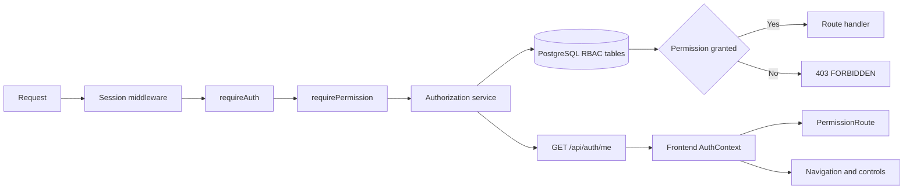

# Authorization and Access Control Design

This document specifies the target authorization architecture for `auth-system`.
It replaces the current binary `users.is_admin` check with global,
database-backed role-based access control (RBAC), while preserving the existing
session, MFA, CSRF, and recent-authentication protections.

**Status:** Implemented.

Related documents: [`README.md`](README.md),
[`SESSION_MANAGEMENT.md`](SESSION_MANAGEMENT.md), [`MFA.md`](MFA.md), and
[`FEATURE_FLAGS.md`](FEATURE_FLAGS.md).

---

## 1. Goals

1. Make authorization explicit, granular, and deny-by-default.
2. Keep the backend authoritative for every access decision.
3. Provide fixed roles that administrators can assign through the application.
4. Expose effective permissions to the frontend for seamless navigation and
   control visibility without treating frontend checks as security boundaries.
5. Apply role revocation on the next backend request rather than waiting for a
   new login.
6. Preserve all existing administrators during migration from `is_admin`.
7. Prevent accidental removal of the final administrator.
8. Record security-relevant role changes for audit and incident response.
9. Behave identically on Windows and Linux.

## 2. Non-goals

The first implementation does not include:

- User-defined or editable roles.
- Organization- or tenant-scoped roles.
- Per-user permission grants outside roles.
- POSIX ACL, Windows ACL, LDAP, Kerberos, or Active Directory integration.
- Delegated administration or approval workflows.
- A general-purpose policy language.
- Resource sharing between users.

Authentication remains the responsibility of the current password, session,
and MFA flows. RBAC determines what an authenticated identity may do.

---

## 3. Terminology

| Term | Meaning |
| --- | --- |
| Authentication | Proving who a user is. |
| Authorization | Deciding what an authenticated user may do. |
| Subject | The authenticated user making a request. |
| Resource | The object or system area being accessed. |
| Action | The operation requested on a resource. |
| Permission | A stable `resource:action` capability such as `settings:update`. |
| Role | A fixed, named bundle of permissions. |
| Effective permissions | The union of permissions granted by all of a user's roles. |
| Ownership | Access limited to the authenticated user's own account or data. |
| Recent authentication | Full authentication completed within `mfa.recent_auth_ttl_ms`. |
| Step-up proof | Additional proof, such as password plus TOTP, for a sensitive action. |

HTTP status behavior:

- `401` means an authenticated session is missing, expired, or recent
  authentication is required.
- `403` means the user is authenticated but lacks the required permission.

---

## 4. Current state

The current application has two effective access levels:

1. An authenticated user, identified by `req.session.userId`.
2. An administrator, identified by `users.is_admin = true`.

`requireAuth` protects authenticated routes. `requireAdmin` loads the user from
Postgres and checks `is_admin`. The frontend receives `isAdmin` from
`GET /api/auth/me`, uses `AdminRoute` for routing, and conditionally displays
the Settings link.

This is a valid coarse authorization mechanism, but it cannot independently
grant settings access, user visibility, or role-management access.

---

## 5. Target authorization model

The system will use global RBAC. Roles and permissions are stored in Postgres
and apply across the application.



The session stores only the authenticated `userId`. Roles and permissions are
not copied into the session because doing so would allow stale privileges to
remain active after an administrator revokes a role.

### 5.1 Authorization rules

1. Public endpoints remain public and do not require roles.
2. Self-service account and MFA endpoints derive the target user exclusively
   from `req.session.userId`.
3. Privileged system and cross-user operations require named permissions.
4. Missing permission always denies access.
5. Request bodies, headers, and frontend state are never trusted as evidence of
   a role or permission.
6. Recent authentication and step-up proof remain additional requirements;
   possessing a permission does not bypass them.

---

## 6. Fixed roles and permissions

Roles are migration-owned system definitions. Administrators can assign them
but cannot create, edit, or delete them through the application.

### 6.1 Permission catalog

| Permission | Capability |
| --- | --- |
| `settings:read` | Read database-backed application settings. |
| `settings:update` | Update application settings. |
| `users:read` | Search users and view their assigned roles. |
| `users:roles:update` | Replace another user's assigned privileged roles. |

Public authentication and authenticated self-service are not represented as
assignable administrative permissions in the first version. They continue to
be governed by route visibility, `requireAuth`, session ownership, recent
authentication, and step-up proof.

### 6.2 Role matrix

| Role | Description | Permissions |
| --- | --- | --- |
| `user` | Base role assigned to every account. | None of the privileged permissions. |
| `support` | Read-only user support access. | `users:read` |
| `settings-manager` | Manage operational application settings. | `settings:read`, `settings:update` |
| `administrator` | Full application administration. | All four permissions |

The `user` role is mandatory and cannot be removed. A user may hold multiple
roles; their effective permissions are the union of those roles.

### 6.3 Endpoint matrix

| Endpoint | Required authorization | Additional checks |
| --- | --- | --- |
| `GET /health` | Public | None |
| `GET /api/csrf-token` | Public | None |
| `GET /api/flags` | Public/optional session | Client-safe flag allowlist |
| `POST /api/auth/register` | Public | Registration feature flag and validation |
| `POST /api/auth/login` | Public | Password, lockout, optional MFA |
| `GET /api/auth/me` | Authenticated self | Active session |
| `POST /api/auth/logout` | Session holder | CSRF |
| `GET /api/auth/mfa` | Authenticated self | Ownership from session |
| `POST /api/auth/mfa/setup` | Authenticated self | Recent authentication |
| `POST /api/auth/mfa/enable` | Authenticated self | Recent authentication and TOTP |
| `POST /api/auth/mfa/disable` | Authenticated self | Password plus MFA proof |
| `POST /api/auth/mfa/recovery-codes/regenerate` | Authenticated self | Password plus MFA proof |
| `POST /api/auth/mfa/verify` | Pending MFA challenge | TOTP or recovery code |
| `GET /api/admin/settings` | `settings:read` | None |
| `PUT /api/admin/settings` | `settings:update` | Recent authentication |
| `GET /api/admin/users` | `users:read` | Bounded search and pagination |
| `GET /api/admin/roles` | `users:roles:update` | Fixed roles only |
| `PUT /api/admin/users/:userId/roles` | `users:roles:update` | Recent authentication and lockout safeguards |

---

## 7. Data model

The migration creates five authorization tables.

### 7.1 `roles`

| Column | Type | Notes |
| --- | --- | --- |
| `id` | `uuid` | Primary key, generated by Postgres. |
| `key` | `text` | Unique stable key, such as `administrator`. |
| `name` | `text` | Human-readable name. |
| `description` | `text` | Displayed in the role-management UI. |
| `is_system` | `boolean` | Always true for fixed roles. |
| `created_at` | `timestamptz` | Creation timestamp. |

### 7.2 `permissions`

| Column | Type | Notes |
| --- | --- | --- |
| `id` | `uuid` | Primary key. |
| `key` | `text` | Unique `resource:action` identifier. |
| `description` | `text` | Human-readable capability. |
| `created_at` | `timestamptz` | Creation timestamp. |

### 7.3 `role_permissions`

| Column | Type | Notes |
| --- | --- | --- |
| `role_id` | `uuid` | FK to `roles`, cascade on role deletion. |
| `permission_id` | `uuid` | FK to `permissions`, cascade on permission deletion. |

The composite primary key is `(role_id, permission_id)`.

### 7.4 `user_roles`

| Column | Type | Notes |
| --- | --- | --- |
| `user_id` | `uuid` | FK to `users`, cascade when a user is deleted. |
| `role_id` | `uuid` | FK to `roles`. |
| `assigned_at` | `timestamptz` | Assignment timestamp. |
| `assigned_by` | `uuid` | Nullable FK to the assigning user; null for migration/bootstrap assignments. |

The composite primary key is `(user_id, role_id)`. Indexes support lookup by
both `user_id` and `role_id`.

### 7.5 `authorization_audit_events`

| Column | Type | Notes |
| --- | --- | --- |
| `id` | `uuid` | Primary key. |
| `actor_user_id` | `uuid` | Nullable FK; null for system actions. |
| `target_user_id` | `uuid` | Nullable FK to the affected user. |
| `action` | `text` | For example `user.roles.updated`. |
| `outcome` | `text` | `success` or `denied`. |
| `before_roles` | `jsonb` | Sorted role keys before the operation. |
| `after_roles` | `jsonb` | Sorted requested/effective role keys. |
| `reason` | `text` | Stable denial or change reason, without secrets. |
| `created_at` | `timestamptz` | Event timestamp. |

Audit events are append-only from the application. Passwords, session IDs,
MFA secrets, recovery codes, and CSRF tokens must never be recorded.

---

## 8. Backend design

### 8.1 Authorization service

`backend/src/services/authorization.service.ts` is the single data-access layer
for RBAC. It provides:

- `getAuthorizationForUser(userId)` returning sorted roles and permissions.
- `userHasPermission(userId, permission)`.
- `listRoles()` returning fixed role metadata.
- `listUsersWithRoles(query)` with bounded search and pagination.
- `replaceUserRoles(actorUserId, targetUserId, roleKeys)` as an atomic operation.
- `assignDefaultRole(client, userId)` for registration.

Permission keys are exported as typed constants. Route code does not use
unvalidated arbitrary strings.

### 8.2 Permission middleware

`requirePermission(permission)`:

1. Reads `userId` only from the server-side session.
2. Returns `401 AUTHENTICATION_REQUIRED` when it is absent.
3. Loads current permissions from Postgres.
4. Calls `next()` when the permission exists.
5. Returns `403 FORBIDDEN` otherwise.

Permissions are initially queried on each protected request. This gives simple,
immediate revocation semantics. Caching may be added later only with explicit
invalidation and a documented maximum stale interval.

### 8.3 Role replacement transaction

Role replacement must be transactional:

1. Begin a transaction.
2. Load and validate the actor, target user, and requested fixed role keys.
3. Add `user` if it was omitted.
4. Lock the `administrator` role row to serialize administrator changes.
5. Reject self-removal of `administrator`.
6. If removing `administrator`, verify that another administrator remains.
7. Replace target role rows.
8. Insert the success audit event.
9. Commit.

Rejected attempts are logged with actor, target, action, and safe reason.
Denials that occur after the actor is authenticated should also create a
denied audit event where feasible.

The database lock is required so two concurrent requests cannot both observe
two administrators and remove both assignments.

### 8.4 Registration

User creation and assignment of the mandatory `user` role occur in one
transaction. A user row must not be committed without its base role.

### 8.5 Error contract

API errors use a stable machine-readable code:

```json
{
  "error": "Admin access required",
  "code": "FORBIDDEN"
}
```

Initial codes:

| Code | HTTP status | Meaning |
| --- | --- | --- |
| `AUTHENTICATION_REQUIRED` | `401` | No authenticated session. |
| `RECENT_AUTH_REQUIRED` | `401` | Session exists but full authentication is stale. |
| `FORBIDDEN` | `403` | Required permission is absent. |
| `INVALID_CSRF_TOKEN` | `403` | CSRF verification failed. |
| `INVALID_ROLE_ASSIGNMENT` | `400` | Unknown or invalid role set. |
| `LAST_ADMINISTRATOR` | `409` | Change would remove the final administrator. |
| `SELF_DEMOTION_NOT_ALLOWED` | `409` | Administrator attempted self-demotion. |
| `USER_NOT_FOUND` | `404` | Target user does not exist. |

The frontend currently retries every mutating `403` after refreshing its CSRF
token. It must retry only when `code === "INVALID_CSRF_TOKEN"`; authorization
denials must not trigger a second request.

---

## 9. Access-management API

### 9.1 List users

`GET /api/admin/users?search=<text>&limit=<n>&cursor=<opaque>`

Requirements:

- Requires `users:read`.
- `limit` is bounded, with a conservative default.
- Search is case-insensitive against email.
- Cursor is opaque and provides deterministic pagination.
- Password, lockout internals, MFA secrets, and session data are never returned.

Example response:

```json
{
  "users": [
    {
      "id": "8f374b32-68ef-4f71-a10c-69c449ec3d91",
      "email": "admin@example.com",
      "roles": ["administrator", "user"],
      "createdAt": "2026-09-30T10:00:00.000Z"
    }
  ],
  "nextCursor": null
}
```

### 9.2 List fixed roles

`GET /api/admin/roles`

Requires `users:roles:update` and returns role keys, names, descriptions, and
permission keys. It does not permit role creation or modification.

### 9.3 Replace user roles

`PUT /api/admin/users/:userId/roles`

```json
{
  "roleKeys": ["settings-manager", "user"]
}
```

Requirements:

- Requires `users:roles:update`.
- Requires recent authentication.
- Uses a strict schema with no unknown fields.
- Rejects unknown role keys.
- Automatically retains `user`.
- Applies final-administrator and self-demotion safeguards.
- Returns the target user's effective roles and permissions.

---

## 10. Authentication response contract

`GET /api/auth/me` is the frontend source of truth:

```json
{
  "user": {
    "id": "8f374b32-68ef-4f71-a10c-69c449ec3d91",
    "email": "admin@example.com"
  },
  "roles": ["administrator", "user"],
  "permissions": [
    "settings:read",
    "settings:update",
    "users:read",
    "users:roles:update"
  ],
  "isAdmin": true,
  "session": {
    "idleExpiresAt": "2026-09-30T18:00:00.000Z",
    "absoluteExpiresAt": "2026-10-01T10:00:00.000Z"
  }
}
```

`isAdmin` remains temporarily for backward compatibility and is derived from
the `administrator` role. It is no longer read from `users.is_admin`.

Login and MFA completion continue to refresh `/me`, ensuring the frontend
receives a consistent authorization payload for both authentication paths.

---

## 11. Frontend design

### 11.1 Auth context

`AuthContext` exposes:

- `roles`
- `permissions`
- `hasPermission(permission)`
- `hasAnyPermission(permissions)`
- Temporary derived `isAdmin`

Roles and permissions are populated from `/me` and cleared on logout, session
expiry, or authentication failure. They refresh:

- On initial application load.
- After direct login.
- After MFA verification.
- When the browser regains focus.
- After a role update affecting the current user.

The frontend may use a `ReadonlySet` internally for efficient checks, while API
contracts remain arrays.

### 11.2 Permission route guard

`PermissionRoute` generalizes `AdminRoute`:

1. Show a loading indicator while authentication initializes.
2. Redirect unauthenticated users to login.
3. Redirect authenticated users without the permission to the dashboard or a
   dedicated forbidden page.
4. Render the page when the permission exists.

Route guards improve user experience only. Direct API requests remain protected
by backend middleware.

### 11.3 Capability-driven navigation

The dashboard displays:

- **Settings** when `settings:read` is present.
- **User Access** when `users:read` is present.

No navigation decision is based directly on a role name. This allows role
bundles to change without rewriting UI checks.

### 11.4 Settings page

- `settings:read` allows the page and its current values to load.
- `settings:update` displays and enables Save.
- A read-only user sees the values without mutation controls.
- `RECENT_AUTH_REQUIRED` produces a clear sign-out/sign-in instruction rather
  than a generic unauthorized message.
- A stale permission resulting in `403` keeps the user signed in, refreshes
  authorization state, and removes unavailable controls.

### 11.5 User Access page

`AdminUsers` provides:

- Debounced user search.
- Bounded pagination.
- Role badges.
- Fixed role descriptions.
- Read-only rendering for `users:read`.
- Assignment controls only for `users:roles:update`.
- Confirmation before mutation.
- Clear handling for final-admin, self-demotion, stale authorization, and
  recent-authentication errors.

The UI must not offer custom role creation in this phase.

---

## 12. Migration and rollout

### Phase 1: Additive schema

1. Create RBAC and audit tables.
2. Seed permissions and fixed roles with `ON CONFLICT DO NOTHING`.
3. Assign `user` to every existing user.
4. Assign `administrator` to every user where `is_admin = true`.
5. Keep `users.is_admin` intact for rollback compatibility.

### Phase 2: Backend authority

1. Deploy the authorization service and permission middleware.
2. Replace `requireAdmin` on settings routes.
3. Add user/role APIs.
4. Return roles and permissions from `/me`.
5. Derive legacy `isAdmin` from RBAC.

### Phase 3: Frontend adoption

1. Hydrate permissions in `AuthContext`.
2. Replace `AdminRoute` and inline `isAdmin` checks.
3. Add read/write-aware settings behavior.
4. Add the User Access page.

### Phase 4: Cleanup

After at least one stable deployment:

1. Confirm all existing admins have `administrator`.
2. Remove remaining reads and writes of `users.is_admin`.
3. Remove compatibility `isAdmin` from API/frontend contracts.
4. Drop `users.is_admin` in a separate migration.

Keeping removal separate provides a safe rollback window and avoids dual-write
logic.

---

## 13. Security invariants

1. The backend makes every authoritative decision.
2. Authorization uses only the session user ID and current database state.
3. The system denies access when role or permission data cannot be loaded.
4. The base `user` role cannot be removed.
5. The final administrator cannot be removed.
6. Administrators cannot demote themselves through the API.
7. Role updates require recent authentication.
8. Permission checks do not bypass CSRF, MFA, ownership, validation, or rate
   limiting.
9. Authorization failures do not leak sensitive account information.
10. Audit records never contain credentials, tokens, or MFA secrets.
11. Database queries remain parameterized.
12. Frontend-hidden controls are not considered a security boundary.

---

## 14. Testing strategy

### 14.1 Backend

Tests must cover:

- Default `user` assignment during registration.
- Permission union across multiple roles.
- Anonymous request returns `401`.
- Authenticated request without permission returns `403`.
- `support` can list users but cannot assign roles.
- `settings-manager` can read and update settings but cannot manage users.
- `administrator` can use every privileged endpoint.
- Settings read and update permissions are independently enforced.
- Recent authentication is required for settings and role mutations.
- Unknown and malformed roles are rejected.
- The base role is automatically retained.
- Self-demotion is rejected.
- Final-administrator removal is rejected, including concurrent attempts.
- Role revocation takes effect on the next request.
- Successful and denied role changes produce safe audit records.
- Existing `is_admin` users are correctly backfilled by migration.

### 14.2 Frontend

Tests must cover:

- `/me` hydrates roles and permissions.
- Logout and `401` clear all authorization state.
- `PermissionRoute` handles loading, unauthenticated, forbidden, and allowed
  states.
- Navigation appears from permissions rather than `isAdmin`.
- Read-only settings users cannot see or invoke Save.
- User listing works with `users:read`.
- Role controls require `users:roles:update`.
- Role mutation confirmation and error messages.
- A stale `403` does not log the user out or trigger a CSRF retry.
- MFA login refreshes `/me` and receives permissions.

### 14.3 Manual QA identities

QA should use separate, non-production accounts:

| Account | Roles | Expected behavior |
| --- | --- | --- |
| Regular user | `user` | Self-service only. |
| Support user | `user`, `support` | Read users; cannot edit roles/settings. |
| Settings manager | `user`, `settings-manager` | Manage settings; cannot manage users. |
| Administrator | `user`, `administrator` | Full privileged access. |
| Multi-role user | `user`, `support`, `settings-manager` | Union of support and settings capabilities. |

Production must not ship fixed test users or default passwords.

---

## 15. Cross-platform behavior

Authorization data and decisions live in PostgreSQL and application code. They
do not depend on:

- Linux users or groups.
- POSIX ACLs.
- Windows accounts or ACLs.
- Platform-specific filesystem paths.

The same RBAC behavior therefore applies on Windows, Linux, macOS, Docker, and
hosted environments.

CI should continue full validation on Ubuntu and add a lightweight
`windows-latest` job for install, type checking, linting, tests, and builds.
PostgreSQL-specific migration verification may remain in Linux/container CI if
the database behavior is identical.

Kerberos, Active Directory, or OpenID Connect may later provide an alternative
way to authenticate a user. External identities or groups would still map to
the roles defined here; the backend permission model remains authoritative.

---

## 16. Operational considerations

- Fixed role and permission keys are part of the application contract and must
  be changed through migrations.
- Operators must verify at least one existing `is_admin` user before deploying
  the middleware switch.
- Authorization audit table retention should be defined before production
  volume grows; security events should not be silently deleted.
- Database failures fail closed for privileged routes.
- Permission-query performance should be measured before caching is added.
- Role changes are effective immediately on backend requests; an already-open
  frontend may display stale controls until `/me` refreshes, but the API still
  denies unauthorized actions.

---

## 17. Future extensions

The schema can later support:

- Custom roles, with separate role-definition permissions.
- Organization-scoped membership and roles.
- Resource ownership and sharing.
- Session revocation by administrators.
- Account lock/unlock and support workflows.
- Audit-log viewing permissions.
- External identity-provider group mapping.
- Fine-grained policies or relationship-based authorization.

These extensions must preserve the core rules: server-authoritative decisions,
deny by default, least privilege, explicit ownership, and auditable changes.
