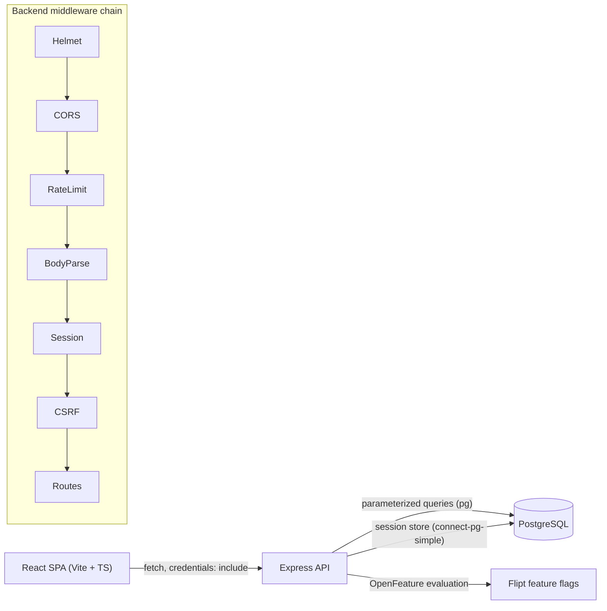

# Secure Auth Full-Stack Shell

A greenfield monorepo demonstrating a production-minded authentication shell: a
**React + TypeScript** single-page app talking to a **Node/Express +
PostgreSQL** API. Authentication uses opaque **server-side sessions** stored in
Postgres and delivered via an `httpOnly`, `SameSite=Strict` cookie (also
`Secure` in production). Security controls are implemented up front; more
advanced items are captured in the roadmap below.

Deployment promotion is documented in [`.github/README.md`](.github/README.md),
Coolify provisioning in [`COOLIFY_SETUP.md`](COOLIFY_SETUP.md), and flag
operations in [`FEATURE_FLAGS.md`](FEATURE_FLAGS.md).

## Architecture



**Auth flow:**

- **Register** — validate input (email + strong password) → hash with Argon2id
  → insert user. Registration does not create a session; the user then logs in.
- **Login** — look up user → verify hash → **regenerate the session id** (anti
  fixation) → bind `userId` to the fresh session → set the `sid` cookie.
- **Protected routes** — `requireAuth` checks `req.session.userId`.
- **Logout** — destroy the session server-side and clear the cookie.

CSRF uses the double-submit pattern (`csrf-csrf`): the SPA fetches a token from
`GET /api/csrf-token` (returned in the response body, since the CSRF cookie is
`httpOnly`) and echoes it back in the `x-csrf-token` header on every mutating
request. The token is bound to the session id, which is why **session
middleware runs before CSRF** in the chain.

## Tech stack

### Backend
- **Express 5** + **TypeScript** (`tsx` for dev, `tsc` for the build).
- **pg** (node-postgres) with a connection `Pool`; all queries parameterized.
- **express-session** + **connect-pg-simple** for server-side sessions in Postgres.
- **argon2** (Argon2id) for password hashing.
- **zod** for environment and request-body validation.
- **zxcvbn** for password strength estimation.
- **helmet** (security headers), **express-rate-limit**, **csrf-csrf**
  (double-submit CSRF), **cors** (strict allowlist).
- **pino** for structured, redacted logging.
- **OpenFeature** with a server-side **Flipt** provider for release flags,
  operational kill switches, and targeted rollouts. Code defaults keep auth
  available when the flag service is disabled or unreachable.

### Frontend
- **Vite + React 19 + TypeScript**, **react-router-dom**.
- Central `api/client.ts` using `fetch` with `credentials: 'include'`; reads the
  CSRF token from `GET /api/csrf-token` and sends it in the `x-csrf-token`
  header on mutations (with a one-shot refresh-and-retry on a 403).
- `AuthContext` holds the current user (via `GET /api/auth/me`);
  `ProtectedRoute` guards `/dashboard`.
- Production loads `/config.json`, generated from runtime `API_URL`, so one
  immutable frontend image can be promoted through QA, staging, and production.
- `FlagContext` consumes only backend-evaluated, client-safe flags. Flipt
  credentials and authoritative flags never enter the browser.
- Minimal, clean UI: Login, Register, Dashboard (shows the user + logout).

## Prerequisites

- **Docker** (Docker Desktop / Compose v2) — runs PostgreSQL. `psql` is not
  required on the host.
- **Node.js 24** and **npm 11**.

## Setup and run

Three pieces start in order: Postgres (Docker), the backend API, then the
frontend dev server. All commands below are PowerShell.

### 1. Start PostgreSQL

From the repository root:

```powershell
docker compose up -d
```

This starts `postgres:16-alpine` on `localhost:5432` and a persistent local
Flipt feature-flag service. Default database credentials
(overridable via env) are user `authuser`, password `authpass`, database
`authdb`.

The schema is owned by **node-pg-migrate** (`backend/migrations/`) — it is no
longer applied via a compose init mount. After the database is up, create the
schema by running the migrations from the backend package (see step 2). This is
a one-time step for a fresh database; migrations are idempotent, so re-running
them against a populated database is safe. `backend/src/db/schema.sql` is kept
only as a human-readable reference. See `DEPLOY.md` for how production deploys
self-migrate.

Check that it is healthy:

```powershell
docker compose ps
```

To inspect the schema without a local `psql`, exec into the container:

```powershell
docker compose exec -T db psql -U authuser -d authdb -c "\dt"
```

### 2. Backend API

```powershell
cd backend
Copy-Item .env.example .env
npm install
npm run migrate   # apply DB migrations (idempotent; needed once for a fresh DB)
npm run dev
```

The backend listens on `http://localhost:4000` and logs `Connected to
PostgreSQL` / `Auth backend listening` on a successful boot. For a production
build instead of the watch-mode dev server:

```powershell
npm run build
npm start
```

**Required environment variables** (`backend/.env`, see `.env.example`):

| Variable         | Purpose                                                        |
| ---------------- | -------------------------------------------------------------- |
| `NODE_ENV`       | `development` \| `test` \| `production` (default `development`).|
| `PORT`           | API port (default `4000`).                                     |
| `CORS_ORIGIN`    | Allowed frontend origin, e.g. `http://localhost:5173`.         |
| `DATABASE_URL`   | Postgres connection string; must match the compose credentials.|
| `SESSION_SECRET` | Session signing secret, **min 32 chars**.                      |
| `CSRF_SECRET`    | CSRF HMAC secret, **min 32 chars**.                            |
| `FLIPT_ENABLED`  | Enables remote flag evaluation; defaults to `false`.           |
| `FLIPT_URL`      | Internal Flipt endpoint.                                       |
| `FLIPT_NAMESPACE`| Environment-isolated flag namespace.                           |
| `FLIPT_TOKEN`    | Optional server-only Flipt client token.                       |

The env loader is zod-validated and **fails fast** at boot if anything is
missing or malformed. Generate strong secrets, for example:

```powershell
node -e "console.log(require('crypto').randomBytes(32).toString('hex'))"
```

### 3. Frontend SPA

In a second terminal:

```powershell
cd frontend
Copy-Item .env.example .env
npm install
npm run dev
```

Vite serves the app on `http://localhost:5173`. `VITE_API_URL` is a local
fallback. Production containers instead require runtime `API_URL` and generate
an uncached `/config.json` before nginx starts.

To produce a production build:

```powershell
npm run build
```

## API reference

Base URL: `http://localhost:4000`. All request/response bodies are JSON.
Mutating requests (`POST`) must include a valid CSRF token in the
`x-csrf-token` header and send cookies (`credentials: 'include'`).

| Method & path            | Auth | Body                    | Success           | Notes |
| ------------------------ | ---- | ----------------------- | ----------------- | ----- |
| `GET /health`            | none | —                       | `200 {status,version,gitSha,buildTime}` | Liveness and build identity. |
| `GET /api/csrf-token`    | none | —                       | `200 {csrfToken}` | Sets the CSRF cookie and returns the token in the body. |
| `GET /api/flags`         | optional | —                    | `200 {flags}` | Returns only allowlisted, server-evaluated client flags. |
| `POST /api/auth/register`| none | `{ email, password }`   | `201 {message}`   | Generic response whether or not the email already exists (no enumeration). |
| `POST /api/auth/login`   | none | `{ email, password }`   | `200 {user}`      | Sets the `sid` session cookie; regenerates the session id. |
| `GET /api/auth/me`       | yes  | —                       | `200 {user}`      | `401` when unauthenticated. |
| `POST /api/auth/logout`  | yes* | —                       | `200 {message}`   | Destroys the session and clears the cookie. |

Common error responses: `400` (validation), `401` (`Invalid email or
password`, generic), `403` (`Invalid CSRF token`), `413` (payload too large),
`429` (rate limit / account lockout).

\* Logout still requires a valid CSRF token; it is safe to call without an
active session.

## Security

### Security controls implemented now (with justification)

- **Argon2id password hashing** — *Threat:* credential theft on DB breach.
  *Justification:* OWASP-preferred memory-hard KDF; plaintext or weak hashes are
  catastrophic if the database leaks.
- **Server-side sessions in an `httpOnly` + `Secure` + `SameSite=Strict` cookie**
  — *Threat:* XSS token theft, session hijacking. *Justification:* `httpOnly`
  blocks JS access to the session id; opaque ids reveal nothing; `SameSite=Strict`
  stops the cookie riding cross-site requests; `Secure` forces HTTPS transport
  in production.
- **Session ID regeneration on login + destroy on logout** — *Threat:* session
  fixation. *Justification:* prevents an attacker-fixed pre-auth session id from
  becoming an authenticated one.
- **CSRF protection (double-submit token via `csrf-csrf`)** — *Threat:*
  cross-site request forgery on state-changing routes. *Justification:*
  defense-in-depth beyond `SameSite`; required because we authenticate via
  cookies. The token is HMAC-backed and bound to the session id.
- **Rate limiting + per-account login throttling / temporary lockout** —
  *Threat:* brute force and credential stuffing. *Justification:*
  `express-rate-limit` caps request volume (global + a tighter limit on
  credential endpoints); `failed_login_attempts` + `locked_until` (5 attempts →
  15-minute lockout) slow targeted guessing at the account level.
- **Input validation with zod** — *Threat:* injection, malformed/oversized
  input, mass-assignment. *Justification:* strict (`.strict()`) schemas reject
  unknown fields and bad data at the edge; only whitelisted fields reach
  services.
- **Parameterized SQL only (pg)** — *Threat:* SQL injection. *Justification:*
  user input is never concatenated into SQL; all statements use `$1, $2, ...`
  placeholders.
- **Helmet security headers (CSP, HSTS, frame-ancestors/X-Frame-Options,
  X-Content-Type-Options, Referrer-Policy) + `x-powered-by` disabled** —
  *Threat:* XSS, clickjacking, MIME sniffing, info leak. *Justification:*
  browser-enforced hardening with minimal code; the API's CSP is locked down to
  `'none'` since it serves only JSON.
- **Strict CORS allowlist with credentials** — *Threat:* unauthorized
  cross-origin API use. *Justification:* only the known frontend origin
  (`CORS_ORIGIN`) may send credentialed requests, and only the needed headers
  are allowed.
- **Strong password policy (length + `zxcvbn` strength check)** — *Threat:*
  weak/guessable passwords. *Justification:* minimum 12 characters and a zxcvbn
  score of at least 3 block trivially crackable passwords. (Login does not
  re-run the strength check, so pre-existing accounts can still sign in.)
- **Generic auth responses (no user enumeration)** — *Threat:* account
  enumeration. *Justification:* identical messages for "unknown email" vs "wrong
  password", a constant-time dummy hash verification on unknown emails to
  equalize timing, and an identical response for duplicate registration.
- **Env-based secrets via a `zod`-validated loader; `.env` gitignored,
  `.env.example` committed** — *Threat:* secret leakage / misconfiguration.
  *Justification:* secrets are never hardcoded and the app fails fast at boot if
  configuration is missing or invalid.
- **Body size limits + session idle/absolute expiry** — *Threat:* DoS via large
  payloads, stale sessions. *Justification:* a 10kb JSON body limit bounds
  resource use; the session has an 8-hour lifetime with a rolling idle refresh,
  shrinking the hijack window.
- **Structured auth-event logging (pino) with redaction, no secrets logged** —
  *Threat:* undetected abuse. *Justification:* enables detection/audit of auth
  events while redacting passwords and password hashes so secrets never reach
  the logs.

### Security roadmap (not yet built)

The following are intentionally out of scope for this shell and documented as
future work:

- Email verification.
- Password reset flow.
- MFA / TOTP.
- WebAuthn / passkeys.
- Breached-password check via HIBP k-anonymity.
- RBAC / fine-grained authorization.
- Redis session store for horizontal scale.
- Signed container provenance and admission-time signature verification.
- Secret rotation.
- WAF / reverse-proxy TLS termination.

## Project structure

```
auth-system/
  docker-compose.yml            # local Postgres service
  DEPLOY.md                     # container build + deploy + migration guide
  FEATURE_FLAGS.md              # OpenFeature/Flipt operations and lifecycle
  VERSION                       # base SemVer for automatic QA build versions
  .gitignore  .gitattributes
  README.md
  backend/
    package.json  tsconfig.json  .env.example
    Dockerfile  .dockerignore  docker-entrypoint.sh  # prod image (self-migrating)
    migrations/                 # node-pg-migrate (source of truth for schema)
    src/
      index.ts                  # app bootstrap + middleware chain
      config/env.ts             # zod-validated env loader
      flags/                    # definitions, targeting, OpenFeature provider
      db/pool.ts                # pg Pool + connection check
      db/schema.sql             # users + session tables
      middleware/
        security.ts             # helmet + strict CORS
        rateLimit.ts            # global + auth rate limiters
        session.ts              # express-session + connect-pg-simple
        csrf.ts                 # csrf-csrf double-submit
        requireAuth.ts          # protected-route guard
        errorHandler.ts         # 404 + centralized error handling
      routes/auth.ts            # register / login / logout / me
      routes/flags.ts           # allowlisted client-safe flag evaluations
      services/user.service.ts  # parameterized user queries + lockout
      utils/
        password.ts             # Argon2id hash/verify
        validation.ts           # zod schemas + zxcvbn policy
        logger.ts               # pino (redacted)
  frontend/
    package.json  tsconfig.json  vite.config.ts  index.html  .env.example
    Dockerfile  .dockerignore  nginx.conf          # prod image (nginx SPA)
    src/
      main.tsx  App.tsx
      api/client.ts             # fetch wrapper (credentials + CSRF)
      auth/AuthContext.tsx      # current-user context
      config/runtimeConfig.ts   # environment-neutral runtime API config
      flags/                    # safe defaults + React flag context
      pages/{Login,Register,Dashboard}.tsx
      components/ProtectedRoute.tsx
```

## License

MIT.
