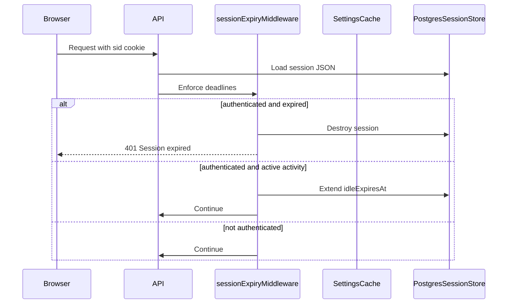
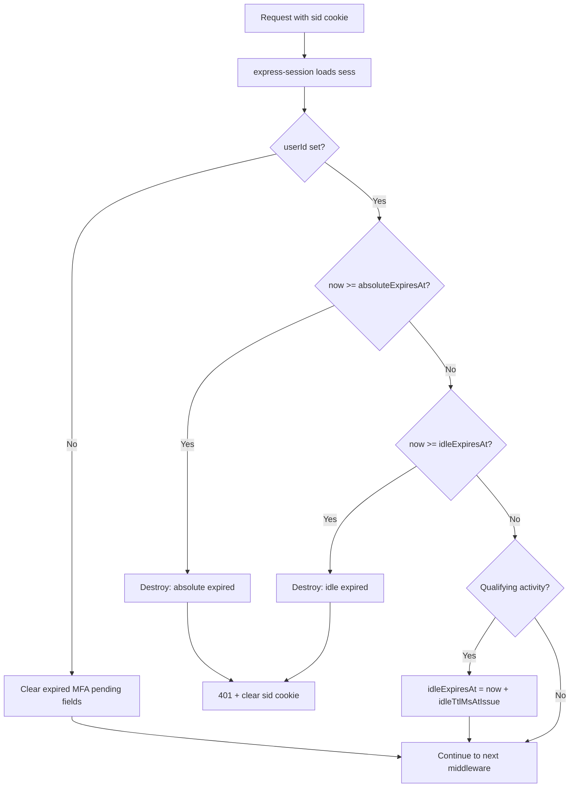

# Session Management Design

This document specifies how login sessions are created, kept active, detected as
idle, expired, and configured in the auth-system backend. It covers server-side
Postgres sessions, dual idle/absolute expiry, MFA intermediate states, and
database-backed timeout configuration with a frontend admin screen.

**Status:** Implemented. Sections that historically distinguished Current vs Target
now describe the live design. Use migrations and the admin settings UI to
configure timeouts.

Related docs: [`MFA.md`](MFA.md), [`FEATURE_FLAGS.md`](FEATURE_FLAGS.md),
[`DEPLOY.md`](DEPLOY.md).

### Local migration and first admin

```powershell
cd backend
npm run migrate
# Promote an existing user (replace the email):
# psql $DATABASE_URL -c "UPDATE users SET is_admin = true WHERE email = 'you@example.com';"
```

### Debugging tests (source-level)

- VS Code / Cursor: Run and Debug → **Debug Backend Vitest (current file)** or
  **Debug Frontend Vitest (current file)** with a test file open. Breakpoints in
  `src/` and `test/` are hit under `--inspect-brk`.
- CLI:
  - Backend: `cd backend; npm run test:debug`
  - Frontend: `cd frontend; npm run test:debug`
  Then attach a Node debugger to the inspector port.

---

## 1. Goals

1. Sessions expire automatically without user action.
2. Expiry is **server-authoritative**; the browser cookie alone must not grant access.
3. Idle and absolute lifetimes are independently configurable.
4. All timeout durations are stored in Postgres and editable from a frontend
   admin settings screen.
5. Settings changes apply **immediately** to new logins and new MFA challenges.
6. **Active authenticated sessions are grandfathered** — already-issued expiry
   deadlines do not change when an operator updates settings.
7. Expiry works correctly with MFA, CSRF, and logout.

Secrets (`SESSION_SECRET`, `MFA_ENCRYPTION_KEY`, etc.) remain environment
variables. Only **durations and windows** are database-configurable.

---

## 2. Terminology

| Term | Definition |
| --- | --- |
| **Session** | A server-side record in Postgres (`session` table) keyed by opaque cookie `sid`. |
| **Authenticated session** | Session with `userId` set after password login (no MFA) or successful MFA verify. |
| **Active session** | Authenticated session where `now < idleExpiresAt` and `now < absoluteExpiresAt`. |
| **Idle session** | Authenticated session where `now >= idleExpiresAt` (no qualifying activity within the idle window). |
| **Expired session** | Idle expired, absolute expired, or store row past `expire`. |
| **Grandfathered session** | Session created before an admin TTL change; keeps snapshotted deadlines and `idleTtlMsAtIssue`. |
| **Qualifying activity** | An authenticated request that extends the idle deadline. |

An active session is **not** the same as “cookie exists”. Anonymous CSRF bootstrap
sessions and pending-MFA sessions have a cookie but are not authenticated.

---

## 3. Session types

| Type | Identified by | Authenticated? | Purpose |
| --- | --- | --- | --- |
| Anonymous / bootstrap | `sid` exists, no `userId` | No | CSRF bootstrap, anonymous feature-flag targeting |
| Pending MFA challenge | `pendingMfaChallenge`, no `userId` | No | Password verified; second factor required |
| Pending MFA setup | `pendingMfaSetup`, `userId` set | Yes, limited | TOTP enrollment in progress |
| Authenticated | `userId` set, not expired | Yes | Normal protected API access |

**Rule:** only `userId` on a non-expired session grants access to protected routes.

---

## 4. Architecture

### 4.1 Components

| Component | Role |
| --- | --- |
| `express-session` | Load/store session JSON; issue `sid` cookie |
| `connect-pg-simple` | Postgres persistence (`session.sid`, `session.sess`, `session.expire`) |
| `sessionExpiryMiddleware` **(Target)** | Authoritative idle + absolute enforcement |
| `requireAuth` | Simple gate: `userId` must be present |
| `settings.service` **(Target)** | Load/cache timeout values from `app_settings` |
| Admin settings API + UI **(Target)** | Read/update timeout configuration |

### 4.2 Middleware order

```
cookieParser
  → sessionMiddleware
  → sessionExpiryMiddleware   (Target)
  → CSRF
  → rate limits
  → routes
```

File references:

- [`backend/src/middleware/session.ts`](backend/src/middleware/session.ts)
- [`backend/src/middleware/requireAuth.ts`](backend/src/middleware/requireAuth.ts)
- [`backend/src/index.ts`](backend/src/index.ts)

### 4.3 Data flow



---

## 5. Session data model

### 5.1 Current `SessionData` fields

Defined in [`backend/src/types/session.d.ts`](backend/src/types/session.d.ts):

| Field | Purpose |
| --- | --- |
| `userId` | Authenticated user id |
| `csrfBootstrapped` | Session persisted for CSRF token binding |
| `flagAnonymousId` | Anonymous flag targeting key |
| `pendingMfaChallenge` | `{ userId, expiresAt }` — pre-MFA login stage |
| `pendingMfaSetup` | `{ encryptedSecret, expiresAt }` — enrollment in progress |
| `authenticatedAt` | Timestamp of last full authentication |

### 5.2 Target fields (expiry snapshots)

Added at successful authentication (login without MFA, or MFA verify success):

| Field | Type | Set once | Purpose |
| --- | --- | --- | --- |
| `sessionStartedAt` | `number` | Yes | When this authenticated session began |
| `idleTtlMsAtIssue` | `number` | Yes | Idle TTL (ms) frozen for this session |
| `idleExpiresAt` | `number` | Updated on activity | Rolling idle deadline |
| `absoluteExpiresAt` | `number` | Yes | Hard stop; never extended |
| `lastActivityAt` | `number` | Updated on activity | Last qualifying request time |

Snapshot at authentication:

```typescript
const now = Date.now();
const idleTtlMs = settings.getDurationMs("session.idle_ttl_ms");
const absoluteTtlMs = settings.getDurationMs("session.absolute_ttl_ms");

session.sessionStartedAt = now;
session.idleTtlMsAtIssue = idleTtlMs;
session.absoluteExpiresAt = now + absoluteTtlMs;
session.idleExpiresAt = now + idleTtlMs;
session.lastActivityAt = now;
session.authenticatedAt = now;
```

Also align the Postgres store row: set `session.expire` to `absoluteExpiresAt` on
save so `connect-pg-simple` can prune the row.

---

## 6. Dual expiry policy

Two independent timers govern authenticated sessions.

### 6.1 Idle timeout (rolling, grandfathered)

| Property | Value |
| --- | --- |
| Setting key | `session.idle_ttl_ms` |
| Default | 8 hours |
| Behavior | Extended on qualifying activity |
| Enforcement | `sessionExpiryMiddleware` |
| Grandfathering | Uses `idleTtlMsAtIssue` snapshotted at login |

On qualifying activity:

```typescript
const now = Date.now();
session.lastActivityAt = now;
session.idleExpiresAt = now + session.idleTtlMsAtIssue;
// absoluteExpiresAt is NEVER modified
```

### 6.2 Absolute timeout (hard cap, grandfathered)

| Property | Value |
| --- | --- |
| Setting key | `session.absolute_ttl_ms` |
| Default | 24 hours **(Target; not enforced today)** |
| Behavior | Fixed at authentication; never extended |
| Enforcement | `sessionExpiryMiddleware` |
| Grandfathering | `absoluteExpiresAt` fixed for session lifetime |

**Check order:** absolute before idle. Once absolute is exceeded, the session
ends even if idle would still be valid.

### 6.3 Examples

Assume idle = 30 minutes and absolute = 8 hours, both snapshotted at login:

| Scenario | Result |
| --- | --- |
| User active every 5 minutes for 7 hours | Session remains active |
| User inactive for 31 minutes | Idle expired → logout |
| User active every minute for 8 hours 1 minute | Absolute expired → logout |
| Admin shortens idle to 5 minutes while user is logged in | Current session unchanged until its snapshotted idle window elapses |
| User logs in again after admin change | New session uses 5-minute idle |

---

## 7. Active session lifecycle

### 7.1 Enforcement algorithm



### 7.2 Qualifying activity

Refresh idle only when **all** are true:

1. `req.session.userId` is set.
2. Session is not already expired.
3. Request path is not excluded.

| Request | Activity? | Notes |
| --- | --- | --- |
| `GET /api/auth/me` | Yes | Session heartbeat |
| Protected `GET` / `POST` / `PUT` / `DELETE` | Yes | Normal usage |
| `GET /health` | No | Probe |
| `GET /api/csrf-token` | No | Bootstrap |
| Pending MFA routes (no `userId`) | No | Not authenticated |
| Configurable excluded paths **(Target)** | No | e.g. high-frequency polling |

### 7.3 Expiry response contract

When middleware destroys an expired session:

| Item | Value |
| --- | --- |
| HTTP status | `401` |
| Body | `{ "error": "Session expired", "reason": "idle" \| "absolute" }` |
| Cookie | Clear `sid` with matching `path`, `secure`, `sameSite` |
| Logs | `session_expired_idle` or `session_expired_absolute` (no sid in log) |

Distinct from never-authenticated access:

```json
{ "error": "Authentication required" }
```

### 7.4 Logout

User-initiated logout always destroys the session immediately, regardless of
deadlines:

1. `req.session.destroy()`
2. Clear `sid` cookie (attributes must match set-cookie options)
3. Return `{ "message": "Logged out" }`

---

## 8. Authentication flows and session creation

### 8.1 Login without MFA

1. Verify password; regenerate session id (anti-fixation).
2. Snapshot expiry fields; set `userId`.
3. Save session; return `{ user }`.

Implemented in [`backend/src/routes/auth.ts`](backend/src/routes/auth.ts).
Expiry snapshots are **Target**.

### 8.2 Login with MFA

1. Verify password; regenerate session id.
2. Set `pendingMfaChallenge` with `expiresAt = now + mfa.challenge_ttl_ms`.
3. Do **not** set `userId`.
4. Return `{ mfaRequired: true }`.

### 8.3 MFA verify success

1. Validate challenge not expired.
2. Validate TOTP or recovery code.
3. Regenerate session id again.
4. Snapshot expiry fields; set `userId`; clear `pendingMfaChallenge`.
5. Return `{ user }`.

### 8.4 MFA pending cleanup

On any request, if `pendingMfaChallenge.expiresAt` or
`pendingMfaSetup.expiresAt` is in the past, delete those fields. This does not
authenticate the session.

---

## 9. Relationship to express-session today

### 9.1 Current behavior

[`backend/src/middleware/session.ts`](backend/src/middleware/session.ts):

| Setting | Current value |
| --- | --- |
| Cookie name | `sid` |
| Store | Postgres via `connect-pg-simple` |
| `rolling` | `true` |
| Cookie `maxAge` | 8 hours (hardcoded) |
| `pruneSessionInterval` | 15 minutes (hardcoded) |
| Enforcement | express-session idle rolling only |

**Gap:** comment says “Absolute session lifetime” but `rolling: true` implements
**idle** timeout, not a hard cap from first login. No absolute expiry exists.

### 9.2 Target behavior

| Layer | Responsibility |
| --- | --- |
| express-session | Transport: persist JSON, issue cookie |
| `sessionExpiryMiddleware` | **Authoritative** idle + absolute enforcement |
| Cookie `maxAge` | Browser hint only (≤ absolute TTL) |
| `session.expire` column | Aligned to `absoluteExpiresAt` for pruning |

Do not rely on cookie expiry alone for security.

---

## 10. Database-backed timeout configuration

### 10.1 Settings table (Target)

```sql
CREATE TABLE app_settings (
  key         text PRIMARY KEY,
  value_ms    bigint,
  value_int   integer,
  description text NOT NULL,
  updated_at  timestamptz NOT NULL DEFAULT now(),
  updated_by  uuid REFERENCES users(id)
);
```

Exactly one of `value_ms` or `value_int` is set per row.

### 10.2 Session-related settings

| Key | Type | Default | Purpose |
| --- | --- | --- | --- |
| `session.idle_ttl_ms` | duration | 8h | Rolling idle lifetime |
| `session.absolute_ttl_ms` | duration | 24h | Max authenticated lifetime |
| `session.store_prune_interval_ms` | duration | 15m | Expired row cleanup interval |

Validation:

- All durations > 0.
- `session.absolute_ttl_ms >= session.idle_ttl_ms`.
- Sane upper bounds (e.g. idle ≤ 30 days) to prevent misconfiguration.

### 10.3 Apply-immediately vs grandfathering

| Change type | Applies to active sessions? |
| --- | --- |
| New login / MFA verify | Uses current DB values immediately |
| Already authenticated session | **No** — keeps snapshotted deadlines |
| New MFA challenge | Uses current `mfa.challenge_ttl_ms` |
| Rate limits, lockouts, flag timeouts | Immediate (separate from session grandfathering) |

### 10.4 Settings service (Target)

Module: `backend/src/services/settings.service.ts`

1. Load all rows from `app_settings` at startup into an in-memory map.
2. Validate on read and on admin update.
3. **Refresh cache immediately** after successful admin save (no restart).
4. Expose `getDurationMs(key)` and `getInt(key)`.

---

## 11. Admin configuration

### 11.1 Authorization (Target)

```sql
ALTER TABLE users ADD COLUMN is_admin boolean NOT NULL DEFAULT false;
```

Only `is_admin = true` users may read or update settings.

### 11.2 Admin API (Target)

| Method | Path | Auth | Description |
| --- | --- | --- | --- |
| `GET` | `/api/admin/settings` | Admin + session | List all settings |
| `PUT` | `/api/admin/settings` | Admin + CSRF + recent auth | Update settings; refresh cache |

Example update body:

```json
{
  "settings": [
    { "key": "session.idle_ttl_ms", "valueMs": 14400000 },
    { "key": "session.absolute_ttl_ms", "valueMs": 43200000 }
  ]
}
```

### 11.3 Frontend settings screen (Target)

Route: `/admin/settings` (visible only to admins)

- Grouped fields: Session, MFA, Lockout, Rate limits, Flags
- Human-readable inputs (minutes / hours) converted to milliseconds
- Inline validation matching backend rules
- Save triggers `PUT /api/admin/settings` and shows confirmation
- Display `updatedAt` / updater when available

---

## 12. Client / API session metadata (Target)

Extend `GET /api/auth/me` for UX (optional):

```json
{
  "user": { "id": "...", "email": "..." },
  "isAdmin": false,
  "session": {
    "idleExpiresAt": "2026-08-23T06:00:00.000Z",
    "absoluteExpiresAt": "2026-08-23T10:00:00.000Z"
  }
}
```

Frontend rules:

- On `401` with `"Session expired"`, clear auth state and redirect to login.
- Display countdown from server timestamps only; **never** trust a client-side timer as authoritative.
- Re-fetch `/api/auth/me` on window focus as a session heartbeat.

---

## 13. Security properties

| Threat | Mitigation |
| --- | --- |
| Session fixation | Regenerate `sid` on login and MFA verify success |
| Stolen session cookie | Idle + absolute snapshotted expiry; server-side destroy |
| CSRF | Session-bound CSRF token; `SameSite=strict` cookie |
| MFA bypass | No `userId` until second factor verified |
| Long-lived hijacked session | Absolute TTL cap |
| Unauthorized settings change | `requireAdmin` + CSRF + recent auth on mutating admin routes |
| Misconfiguration | Validated settings with min/max bounds |
| Session enumeration | Generic 401 messages; no sid in logs |

---

## 14. Observability

Log (structured, no secrets):

| Event | When |
| --- | --- |
| `login_success` | Password login completes (non-MFA) |
| `mfa_challenge_started` | MFA challenge created |
| `mfa_verify_success` | MFA verify completes |
| `session_expired_idle` | Idle deadline exceeded |
| `session_expired_absolute` | Absolute deadline exceeded |
| `logout_success` | User logout |
| `settings_updated` | Admin saves timeout settings |

Never log: `sid`, CSRF tokens, passwords, TOTP codes, recovery codes.

---

## 15. Implementation status

| Capability | Status |
| --- | --- |
| Postgres session store | Implemented |
| Cookie `sid` + `userId` auth gate | Implemented |
| Session regenerate on login / MFA verify | Implemented |
| MFA pending challenge TTL (from `app_settings`) | Implemented |
| Absolute session expiry | Implemented |
| Snapshotted `idleExpiresAt` / `absoluteExpiresAt` | Implemented |
| `sessionExpiryMiddleware` | Implemented |
| `app_settings` table | Implemented |
| Admin settings API + UI | Implemented |
| `/api/auth/me` session metadata + `isAdmin` | Implemented |

---

## 16. Implementation phases

### Phase 1 — Settings foundation

- Migration: `app_settings` + seed defaults
- Migration: `users.is_admin`
- `settings.service.ts` with cache and validation

### Phase 2 — Session expiry enforcement

- Extend `SessionData` with snapshot fields
- Set snapshots in login and MFA verify routes
- Add `sessionExpiryMiddleware`
- Wire middleware in `index.ts`

### Phase 3 — Admin API

- `GET/PUT /api/admin/settings`
- `requireAdmin` middleware
- Expose `isAdmin` on `/api/auth/me`

### Phase 4 — Frontend settings screen

- Admin route and form
- Duration inputs and validation

### Phase 5 — Hardening

- Tests: idle expiry, absolute expiry, grandfathering, activity refresh
- Logout cookie attribute parity
- Documentation cross-links

---

## 17. Acceptance criteria

1. Authenticated sessions expire after configured idle inactivity (per snapshotted TTL).
2. Authenticated sessions expire after configured absolute lifetime, even with continuous activity.
3. Admin TTL changes do not alter deadlines on already-authenticated sessions.
4. New logins immediately use updated DB timeout values.
5. Idle refresh occurs only on qualifying authenticated requests.
6. Expired sessions cannot access protected routes.
7. Session rows are pruned after absolute deadline via store `expire`.
8. All session-related timeout durations are editable from the frontend admin screen.
9. No timeout values remain hardcoded in application logic (seed migration defaults only).
